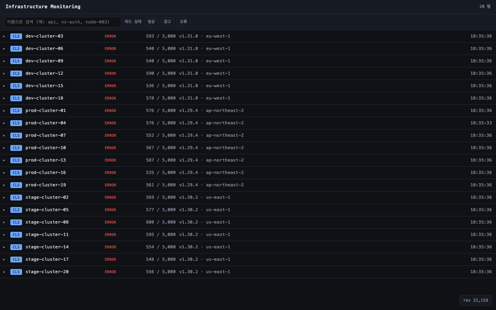
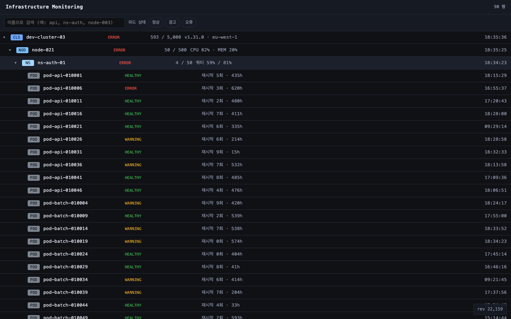
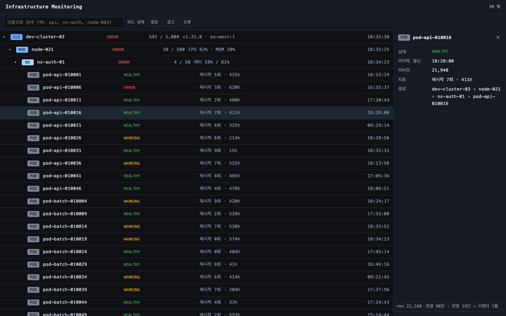
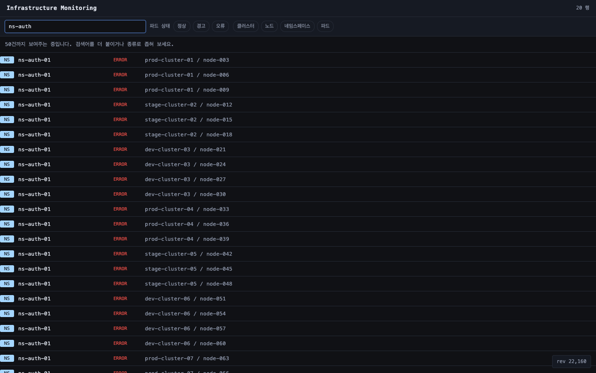
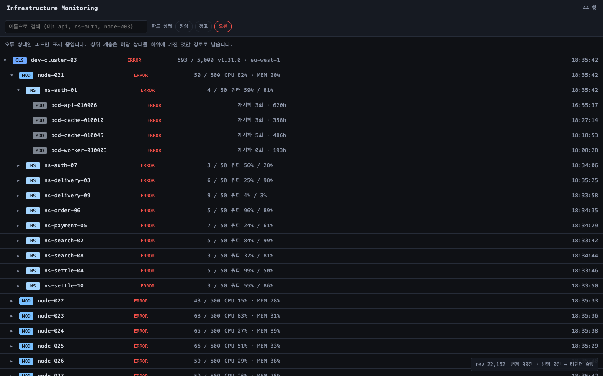
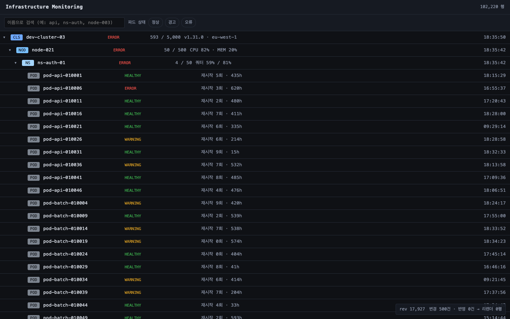
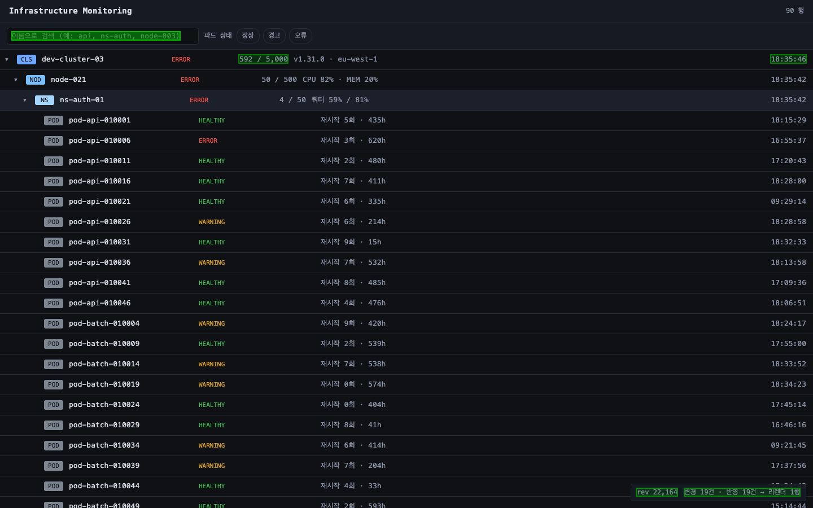

# Infrastructure Monitoring Service

Cluster → Node → Namespace → Pod 4계층, Pod 기준 10만 건 규모의 인프라 모니터링 콘솔입니다.



---

## 프로젝트 실행 방법

모든 명령은 저장소 루트에서 실행합니다.

### 1. 서비스 기동

```bash
# MySQL
docker compose up -d

# 백엔드 :8080  최초 1회만 Mock 데이터 생성 플래그를 붙입니다 (102,220행)
(cd backend && ./gradlew bootRun --args='--app.generator.enabled=true')
(cd backend && ./gradlew bootRun)                    # 이후에는 이것만

# 프론트엔드 개발 서버 :5173  (새 터미널)
(cd frontend && npm install && npm run dev)
```

기동하면 2초마다 파드 50건의 상태가 바뀝니다(상태 변화 시뮬레이터). `--app.simulator.enabled=false` 로 끕니다.

### 2. 검증

```bash
(cd backend  && ./gradlew test)                      # 백엔드 63개
(cd frontend && npm run build && npm run preview)    # :4173  아래 두 가지의 전제
(cd frontend && npm run check)                       # 화면 동작 7개
(cd frontend && npm run measure)                     # 성능 목표 7항목
```

| 명령 | 검사하는 것 | 실패하면 |
| --- | --- | --- |
| `./gradlew test` | API 계약, 계층·커서·검색 경계, 델타 유실, 집계 불변식, **실행 계획** | 종료 코드 1 |
| `npm run check` | 눈으로는 확인되지 않는 화면 규칙 7개 (DOM 행 수, 화면 밖 변경 리렌더, 갱신 주기, 경로 재요청, 검색 결과 위치, 필터 시 목록 유지, 펼칠 때 밀림) | 종료 코드 1 |
| `npm run measure` | 성능 목표 7항목을 목표 대비 판정 | 종료 코드 1 (참고용인 메모리는 제외) |


## 사용한 기술 및 선택 이유

| 기술 | 이유 |
| --- | --- |
| MySQL 8.4 | 실행 계획을 직접 확인할 수 있는 RDB 가 필요했습니다 |
| Spring Boot 3.5 / Java 21 | 조회 API 5개 규모에 맞는 최소 구성입니다 |
| JPA + 네이티브 SQL + JDBC | 조회는 네이티브 SQL, 단건 PK 조회는 파생 메서드, 10만 건 적재는 JDBC batch 로 나눴습니다 |
| Flyway | 스키마만 담당합니다. 데이터 적재는 생성기가 따로 합니다 |
| Testcontainers | 테스트용 MySQL 을 컨테이너로 띄웁니다 |
| React 19 / TypeScript / Vite | 부분 갱신을 참조 동일성으로 통제합니다 |
| `@tanstack/react-virtual` | 10만 행을 DOM 에 그리지 않기 위한 유일한 외부 의존입니다 |
| Playwright + CDP | 측정 조건(CPU 4x · 캐시 비활성화)을 개발자도구와 같은 API 로 겁니다 |

## 프로젝트 구조

```
osc-monitor/
├── docker-compose.yml
├── backend/src/
│   ├── main/java/com/osc/monitor/
│   │   ├── resource/
│   │   │   ├── controller/       ResourceController + dto/
│   │   │   ├── service/          ResourceService
│   │   │   ├── repository/       ResourceRepository + Custom…Impl(네이티브 SQL) + entity/
│   │   │   └── domain/           종류 · 상태 · 집계 · 커서 · 경로 · LIKE 패턴
│   │   ├── revision/repository/  전역 리비전
│   │   ├── generator/            Mock 데이터 생성기
│   │   ├── simulator/            상태 변화 시뮬레이터
│   │   └── support/              오류 코드 · 전역 예외 처리
│   ├── main/resources/db/migration/   Flyway (스키마만)
│   └── test/                     Testcontainers 기반 통합 테스트 + 성능 기록
└── frontend/
    ├── src/
    │   ├── api.ts                응답 계약과 호출
    │   ├── App.tsx · Toolbar · Hud
    │   ├── perf.ts               측정 계측점
    │   ├── tree/                 useTree(저장소) · TreeList(가상 스크롤) · TreeRow · DetailPanel
    │   └── search/               useSearch · SearchResults
    └── scripts/
        ├── measure.mjs           성능 목표 7항목 측정·판정
        └── check-ui.mjs          화면 동작 회귀 확인
```

---

## 구현한 기능

### 리소스 탐색

4계층을 트리로 그리고 하위는 펼칠 때 조회합니다(`GET /roots` → `GET /{id}/children`, 커서 페이징).

화살표는 펼치기, 행 본문은 선택으로 나눴습니다. 한 행이 두 동작을 겸하면 상세를 보려다 트리가 움직입니다. 로딩 표시는 화살표가 맡습니다(`▸` → `⋯` → `▾`).

### 리소스 선택

우측 상세 패널에 종류·상태·마지막 갱신·리비전·하위 집계·타입별 지표와 루트부터의 경로를 보여줍니다.

단건 조회 API 는 두지 않았습니다. 목록 응답이 필요한 값을 다 담고 있어 받아 둔 데이터로 그리고, 경로만 `GET /{id}/ancestors` 로 받습니다.

| 4계층 드릴다운 | 상세: 루트부터의 경로까지 |
| --- | --- |
|  |  |

### 검색

250ms 디바운스 후 `GET /search` 를 부릅니다. 결과는 트리 자리에 목록으로 그리고, 고르면 트리로 돌아가며 그 위치가 펼쳐지고 해당 행으로 스크롤됩니다.

항목마다 경로를 붙입니다. `ns-auth-01` 은 여러 노드에 반복되어 66건이라 이름만으로는 구분되지 않습니다.



### 필터

파드 상태를 기준으로 거릅니다(`?status=`). 오류를 고르면 오류인 파드가 남고 상위 계층은 경로로 남습니다. 적용 중에는 화면이 그 의미를 문장으로 띄웁니다.



### 데이터 갱신

2초 폴링으로 `POST /changes` 를 부르고, 화면에 펼친 범위의 변경분만 받습니다. 바뀐 행만 다시 그립니다(`변경 19건 → 리렌더 1행`).

### 표시 항목

모든 행에 이름 · 상태 · 마지막 갱신 시간과 종류별 지표를 둡니다.

| 종류 | 지표 | 하위 집계 |
| --- | --- | --- |
| Cluster | 버전 · 리전 | 하위 오류 수와 분모(총 파드 수) |
| Node | CPU · 메모리 | 〃 |
| Namespace | 쿼터 | 〃 |
| Pod | 재시작 횟수 · 수명 | 없음 (하위 계층이 없습니다) |

`오류 601 / 5,000` 처럼 분모를 붙입니다. 직속 자식 수(클러스터는 10)는 분모가 되지 못합니다.

상위 계층의 상태는 하위를 굴려 올린 값이라 클러스터 20개가 모두 ERROR 로 같습니다. 상위에서 구분을 만드는 것은 집계 열입니다.

### Mock 데이터 생성

Cluster 20 / Node 200 / Namespace 2,000 / **Pod 100,000** = 총 102,220행.

- 시드 고정(`Random(42)`). 성능 측정을 재현하려면 매번 같은 데이터가 나와야 합니다
- id 를 계층별 고정 구간으로 직접 할당합니다(cluster 1~, node 1001~, namespace 100001~, pod 10000001~). 부모 INSERT 결과를 기다리지 않고 자식의 `path` 를 계산할 수 있습니다
- JDBC batch 로 1,000건씩 적재합니다. 102,220행에 1.7초 걸립니다
- 상태 분포는 HEALTHY 90% / WARNING 7% / ERROR 3% 입니다 (생성 시점 기준)
- 파드 상태를 먼저 만들고 부모 단위로 접어 올려 집계 컬럼을 INSERT 시점에 채웁니다
- 이름에 의미 있는 토큰을 섞습니다(`prod-cluster-01`, `ns-payment-01`, `pod-api-000417`)

### 상태 변화 시뮬레이터

2초마다 파드 50건의 상태를 바꾸고 경로에 적힌 조상의 집계까지 갱신합니다. 데이터가 고정돼 있으면 델타 API 를 확인할 수 없어 넣었고, 실제 watch 가 붙으면 이 자리를 그것이 대신합니다.

---

## 구현 과정에서 고려한 사항

요구사항이 정해 주지 않아 직접 정해야 했던 것들입니다.

### 갱신 방식

**2초 주기 폴링.**

- 모니터링 화면이 견디는 지연이 초 단위라 스트리밍의 이점이 작습니다
- 변경분만 내려주므로 폴링이어도 전송량이 스트리밍과 거의 같습니다
- 재연결·백프레셔·초기 스냅샷 정합을 다루지 않아도 됩니다
- SSE 로 바꾸더라도 `/changes` 의 계약(리비전 기준 증분)은 그대로 씁니다

### 상위 계층의 상태

**하위 상태를 롤업해 계산.** 파드는 자기 상태를 쓰고, Cluster·Node·Namespace 는 하위 파드 상태를 굴려 올립니다.

- 이 방식에서는 오류 비율이 낮아도 **모든 클러스터가 ERROR 로 표시**됩니다
- 따라서 상위 계층의 비교 기준은 상태 열이 아니라 집계 열(`오류 601 / 5,000`)입니다

비율 기반 산정도 만들어 봤지만 되돌렸습니다. Mock 데이터는 클러스터마다 같은 확률 분포에서 생성되어 오류율이 비슷하고, 임계값을 어디에 두든 20개가 함께 움직입니다. 생성기가 클러스터마다 다른 오류율을 주면 해결되지만 이번 범위에 넣지 않았습니다.

### 필터의 적용 계층

**파드 상태를 기준으로 적용.** 상위 계층은 그 상태를 하위에 갖고 있는지로 판정해 경로로 남깁니다.

모든 계층에 `WHERE status = ?` 를 그대로 걸면 "정상만 보기" 에서 루트가 0건이 되어, 정상인 파드 9만 건에 도달할 경로가 없어집니다.

### 검색 매칭 범위

**이름 시작과 하이픈 뒤 토큰 시작을 함께.** 앞부분 매칭만 지원하면 `api` 를 쳤을 때 0건이 됩니다.

대가로 읽는 인덱스 행이 최대 45배 벌어지지만, 최악이 60ms 안팎이라 목표 300ms 안에 듭니다.

### 진행 표시 위치

**부모 행의 화살표.** "불러오는 중" 행을 끼워 넣으면 목록 길이가 `20 → 21 → 30` 으로 두 번 움직입니다. 필터도 같은 이유로 병렬로 다 받은 뒤 한 번에 교체합니다.

### 측정 주체

**테스트.** 사람이 개발자도구로 한 번 재고 끝내면 코드가 바뀌어도 문서의 수치는 그대로 남습니다.

---

## 설계 문서

| 항목 | 결론 |
| --- | --- |
| 프론트엔드 렌더링 전략 | 가상 스크롤로 DOM 행을 31개에 고정하고, 정규화 `Map` 과 참조 동일성으로 바뀐 행만 다시 그립니다 |
| 계층 데이터 모델링 | 인접 리스트(`parent_id`)와 경로 열거(`path`)를 함께 쓰고, 하위 집계는 쓰기 시점에 부모가 들고 있습니다 |
| 인덱스 및 쿼리 전략 | 인덱스 4개. 커서 페이징으로 읽는 행을 페이지 크기에 묶습니다 |
| API 설계 | 조회 5개. `/changes` 가 화면 범위를 받아 응답과 조회 비용을 화면 크기에 비례시킵니다 |

### 프론트엔드 렌더링 전략

| 축 | 방법 | 결과 |
| --- | --- | --- |
| 처음에 몇 개를 그리나 | 가상 스크롤 | 102,220행 중 DOM 31행 |
| 갱신 때 몇 개를 다시 그리나 | 정규화 `Map` + 참조 동일성 | 변경 19건 중 리렌더 1행 |

정적 파일과 JSON API 만 두는 CSR 입니다.

- 성능 목표 일곱 중 여섯이 **상호작용 이후**의 시간이라 SSR 로 개선되는 항목이 없습니다
- 화면이 초 단위로 바뀌어 SSG 는 빌드 시점 HTML 이 만들자마자 낡습니다

#### DOM 에는 보이는 구간만 그립니다
 행 높이를 36px 로 고정해 스크롤 위치에서 인덱스를 바로 구합니다(오버스캔 8). 102,220행을 전부 펼쳐도 DOM 행은 31개이고, 이 값은 목록 길이와 무관합니다.



#### 갱신 때는 바뀐 행만 다시 그립니다

노드를 중첩 객체로 들면 하위 하나가 바뀔 때 상위 참조가 전부 새로 만들어져 화면 전체가 리렌더됩니다. 정규화된 `Map<id, Resource>` 로 들고, 델타를 병합할 때 Map 은 새로 만들되 바뀐 항목만 교체합니다.

지켜야 할 규칙이 넷입니다.

- 행에 `Set` 이나 배열을 내려보내지 않습니다. 매번 새 참조가 되어 `React.memo` 가 무력화됩니다
- 콜백을 매 렌더 새로 만들지 않습니다. 내부에서 `ref` 를 거울로 써서 `useCallback([])` 을 유지합니다
- 같은 리비전이면 덮지 않습니다. 값은 같은데 참조가 달라져 헛되이 다시 그려집니다
- 바뀐 것이 없으면 이전 상태를 그대로 돌려줍니다



> 화면에 90행이 있고 서버가 19건을 내려줬을 때 다시 칠해진 곳은 집계 셀·시각 셀·계측 패널뿐입니다.

| 기법 | 채택 | 이유 |
| --- | --- | --- |
| 가상 스크롤 | 채택 | 10만 행을 DOM 에 그리지 않기 위해 |
| 지연 로딩 | 채택 | 펼칠 때만 해당 계층을 조회 |
| 청크 분할 / 타임 슬라이싱 | 미채택 | 한 번에 다루는 데이터가 펼치기 200건 · 델타 500건이라 메인 스레드를 붙잡는 구간이 없습니다 |
| Canvas / WebGL | 미채택 | DOM 으로 목표를 넘겼고, 텍스트 선택·접근성을 다시 만들어야 합니다 |

### 계층 데이터 모델링

| 결정 | 이유 |
| --- | --- |
| 인접 리스트(`parent_id`)와 경로 열거(`path`)를 함께 | 트리를 다루는 방향이 "아래로 한 칸" 과 "루트까지 위로" 둘이라서 |
| `rev` 를 `updated_at` 과 분리 | 델타 경계를 시각으로 잡으면 같은 밀리초를 놓치거나 중복해서 |
| 하위 집계를 부모 컬럼으로 | 조회 시점에 세면 하위 5,000행을 읽어야 해서 |
| 타입별 지표를 `metrics_json` 으로 | 조건절에 안 들어가고 표시만 하는 값이라 |

```sql
CREATE TABLE resource
(
    id           BIGINT       NOT NULL,            -- 계층별 고정 구간에서 직접 할당 (cluster 1~, pod 10000001~)
    parent_id    BIGINT       NULL,                -- 인접 리스트. 한 계층 아래로 내려갈 때
    type         TINYINT      NOT NULL,            -- CLUSTER/NODE/NAMESPACE/POD. 깊이는 여기서 파생
    name         VARCHAR(120) NOT NULL,
    status       TINYINT      NOT NULL,            -- 파드는 자기 상태, 상위는 하위 롤업
    path         VARCHAR(64)  NOT NULL,            -- 경로 열거 '/1/1001/100001/'. 루트까지 한 번에 올라갈 때
    updated_at   DATETIME(3)  NOT NULL,            -- 마지막으로 바뀐 시각. 화면 표시 전용
    rev          BIGINT       NOT NULL,            -- 전역 단조 증가 정수. 델타 조회 기준
    error_cnt    INT          NOT NULL DEFAULT 0,  -- 하위 집계. 조회가 아니라 쓰기 시점에 계산
    warn_cnt     INT          NOT NULL DEFAULT 0,
    child_cnt    INT          NOT NULL DEFAULT 0,  -- 직속 자식 수
    leaf_cnt     INT          NOT NULL DEFAULT 0,  -- 하위 파드 총수. 비율 표시의 분모
    metrics_json JSON         NULL,                -- 조건절에 안 들어가는 타입별 지표
    PRIMARY KEY (id)
);
```

#### 인접 리스트와 경로 열거를 함께 씁니다

트리를 다루는 방향이 둘이라 방식도 둘을 씁니다.

- **아래로 한 칸** (펼치기) → `parent_id`. 한 번에 한 계층만 조회합니다
- **루트까지 위로** (검색 결과의 위치 표시) → `path`. 애플리케이션에서 파싱해 `WHERE id IN (...)` PK 조회 한 번으로 끝냅니다

경로에는 이름 대신 id 를 담아 리네임에 깨지지 않게 했습니다.

#### `rev` 와 `updated_at` 은 다른 문제를 풉니다

| 컬럼 | 답하는 질문 | 쓰이는 곳 |
| --- | --- | --- |
| `updated_at` | 마지막으로 바뀐 **시각**은? | 화면 표시 전용. 조회 조건으로는 쓰지 않습니다 |
| `rev` | 전 시스템에서 **몇 번째** 변경인가? | 델타 조회 기준 |

델타 경계를 시각으로 잡으면 같은 밀리초 안의 변경을 놓치거나(`>`) 이미 받은 것을 다시 보냅니다(`>=`). 전역 단조 증가 정수를 쓰면 `since=rev` 가 "이 리비전 이후 바뀐 것 전부" 로 정확해집니다.

리비전 발급에는 비관적 락을 씁니다. 경합 구간이 `revision_seq` 한 행뿐이라 재시도로 틱 전체를 다시 도는 낙관적 락보다 유리합니다.

#### 하위 집계는 부모가 들고 있습니다

"이 클러스터에 오류가 몇 개인가" 를 조회 시점에 세면 인덱스가 있어도 하위 5,000행을 읽습니다. 쓰기 시점에 계산해 컬럼으로 유지합니다. `leaf_cnt` 는 비율 표시의 분모입니다.

#### 타입별 지표는 `metrics_json` 에 둡니다

조건절에 들어가는 값은 컬럼, 보여주기만 하는 값은 JSON 입니다. Node 의 CPU·메모리, Namespace 쿼터, Pod 재시작 횟수는 정렬도 검색도 필터도 하지 않습니다.

### 인덱스 및 쿼리 전략

| 쿼리 | 쓰는 인덱스 | 읽는 행 |
| --- | --- | --- |
| 펼치기 | `uk_children (parent_id, name)` | 페이지 크기 (50~200) |
| 조상 조회 | `PRIMARY (id)` | 깊이만큼 (최대 4) |
| 검색 | `idx_search (name)` | 2,256 ~ 102,220 (검색어에 따라) |
| 델타 | `uk_children` 로 화면 범위를 먼저 좁힘 | 화면 크기 |
| 상태 필터 | `uk_children` + 집계 컬럼 | 부모 아래 자식 수 |

**검색만 데이터 규모에 비례하고 나머지는 상수입니다.** 인덱스는 그것을 쓰는 쿼리가 생기는 시점에 추가했습니다. 스키마(V1)에는 세컨더리 인덱스가 없고 펼치기 쿼리를 구현하면서 V2 로 들어왔습니다.

#### 펼치기: 유니크 인덱스 하나로 정렬·무결성·페이징

- **유니크 선언.** 같은 부모 아래 이름이 유일하다는 도메인 규칙을 인덱스에 넣어 정렬과 무결성을 함께 얻습니다
- **커서 페이징.** `LIMIT/OFFSET` 대신 정렬 키 `(name, id)` 를 커서로 씁니다. 전체 건수와 무관하게 페이지 크기만 읽습니다

```
-- uk_children 사용
-> Index lookup on resource using uk_children (parent_id=100001)  (actual time=0.0177..0.0466 rows=50)

-- IGNORE INDEX (uk_children)
-> Filter: (resource.parent_id = 100001)  (actual time=1.45..56.3 rows=50)
    -> Index scan on resource using idx_search  (actual time=0.0249..53.1 rows=102220)
```

**0.05ms 대 56.3ms.** 대조군에서도 정렬 비용은 들지 않습니다. `idx_search (name)` 가 `ORDER BY name` 을 대신 만족시키고, `parent_id` 로 범위를 좁히지 못해 102,220건을 훑습니다.

#### 검색: 이름 시작과 하이픈 뒤 토큰 시작을 함께

```sql
WHERE name LIKE 'api%' ESCAPE '!' OR name LIKE '%-api%' ESCAPE '!'
```

두 번째 조건은 앞이 고정되지 않아 인덱스를 순서대로 훑습니다. 읽는 인덱스 행은 검색어에 따라 2,256(`api`)에서 102,220(결과 없음)까지 벌어집니다.

`ORDER BY name` 이 인덱스 순서와 같아 `LIMIT 50` 을 채우면 멈추므로 정렬 비용은 0 입니다. 최악이 60ms 안팎이라 목표 300ms 안에 들지만, 비용이 데이터 규모에 선형이라 파드가 100만이면 600ms 근처가 됩니다.

#### 상태 필터: 계층마다 의미가 다릅니다

파드는 자기 상태로, 상위 계층은 하위에 그 상태가 있는지로 거릅니다. 부모가 집계 컬럼을 들고 있어 하위를 한 번도 읽지 않습니다.

```sql
-- status = ERROR 인 경우
AND ( (type = :leafType AND status = :status)
   OR (type <> :leafType AND error_cnt > 0) )
```

상위 조건은 상태에 따라 갈립니다. ERROR 는 `error_cnt > 0`, WARNING 은 `warn_cnt > 0`, HEALTHY 는 `1 = 1` 로 상위를 거르지 않습니다. 정상만 거르지 않는 이유는 "전부 정상인 상위만" 이 되면 정상 파드를 품은 대부분의 상위가 잘려나가기 때문입니다.

조건이 OR 로 갈라지고 `status` 가 선행 컬럼이 될 수 없어 필터용 인덱스는 만들지 않았습니다.

#### 조회는 네이티브 SQL 로 씁니다

조회가 전부 커스텀 쿼리(커서 페이징·토큰 경계 검색·델타 범위)라 나가는 SQL 과 코드를 같게 유지합니다. `findById` 처럼 그냥 얻어지는 것만 Spring Data 를 씁니다.

#### 대량 적재 뒤 `ANALYZE TABLE` 을 실행합니다

통계가 낡으면 옵티마이저가 인덱스를 쓰지 않습니다. 자동 재계산은 백그라운드라 시점 보장이 없어, 적재가 끝난 지점에서 명시적으로 부릅니다.

### API 설계

| Method | Endpoint | 설명 |
| --- | --- | --- |
| GET | `/api/resources/roots` | 클러스터 목록 + 현재 리비전 |
| GET | `/api/resources/{id}/children` | 하위 한 계층 (커서 페이징, 상태 필터) |
| GET | `/api/resources/{id}/ancestors` | 조상 (검색 결과 위치까지 펼치기용) |
| GET | `/api/resources/search` | 이름 검색 (결과 + 조상 이름 사전) |
| POST | `/api/resources/changes` | 델타 (화면에 펼친 범위의 변경분) |

#### `/changes` 는 화면 범위를 받습니다

```jsonc
// 요청
{ "since": 10482, "sinceId": null, "openParentIds": [1, 1001, 100001], "includeRoots": true }
// 응답
{ "maxRev": 10537, "maxId": null, "changed": [ /* 바뀐 리소스 */ ], "truncated": false }
```

클라이언트가 지금 펼쳐서 보고 있는 부모 id 를 보내므로 응답 크기가 화면 크기에 비례합니다. 조회 비용도 같습니다. `since` 가 뒤처져 `rev` 구간이 넓어져도 옵티마이저가 `uk_children` 으로 화면 범위를 먼저 좁혀 읽는 행은 50 에 머뭅니다.

조회인데 POST 인 이유는 펼친 부모가 100개를 넘으면 URL 길이 한계에 걸리기 때문입니다. 목록에는 상한 1,000 을 둡니다.

#### 델타 커서는 `(rev, id)` 튜플입니다

한 틱이 파드 50건과 조상들을 같은 리비전으로 바꾸므로 한 리비전에 여러 행이 몰립니다. 리비전 하나만 커서로 쓰면 상한에 걸릴 때 놓치거나 중복됩니다.

#### 조상은 계층을 거슬러 올라가지 않습니다

`path` 를 파싱해 PK 조회 한 번으로 끝냅니다.

#### 검색은 트리와 다른 진입점입니다

조상 이름을 `조상 id → 이름` 사전으로 한 번만 함께 보내 항목마다 경로를 그립니다. 트리의 상태 필터는 검색에 넘기지 않습니다. 트리 필터는 파드 상태 기준인데 검색에 넘기면 서버가 모든 타입을 자기 `status` 로 걸러 의미가 달라집니다.

#### 만들지 않은 것

단건 상세 조회 엔드포인트를 두지 않았습니다. 없는 id 에 대한 응답은 그 정보를 얻는 데 추가 비용이 드는지로 나눴습니다.

| API | 없는 id | 이유 |
| --- | --- | --- |
| `GET /{id}/children` | 200 + 빈 목록 | 존재 확인 쿼리가 상시 비용이 됩니다 |
| `GET /{id}/ancestors` | 404 | 대상을 어차피 읽어야 `path` 를 얻으므로 추가 비용이 0 입니다 |

---

## 성능 측정 결과

> **측정 방법과 상세 결과는 [docs/performance.md](docs/performance.md) 에 별첨했습니다.**

조건은 원문 그대로입니다. production build(`vite preview`) · CPU 4x throttling · 캐시 비활성화 · 뷰포트 1440×900 · warm-up 1회를 버리고 3회 중위값.

```bash
(cd backend  && ./gradlew test)     # 백엔드 API 응답시간 → build/reports/perf/backend-api.md
(cd frontend && npm run measure)    # 화면 7항목 → measure-result.json
```

스로틀링이 실제로 걸렸는지 고정 작업량을 배율만 바꿔 재서 확인합니다(실측 4.19배).

| 원문 항목 | 목표 | 측정값 |
| --- | --- | --- |
| 최초 진입 → 상위 계층이 보이고 상호작용 가능 | 500ms | **219.3ms** |
| 하위 계층 펼치기 / 축소 | 100ms | **47.6ms** |
| 검색어 입력 → 결과 표시 (디바운스 제외) | 300ms | **24.2ms** |
| 필터 적용 → 화면 반영 | 200ms | **21.9ms** |
| 10만 건 스크롤 프레임레이트 | 55fps | **중위 119.9fps**, 18.2ms 초과 0 / 239 프레임 |
| 데이터 갱신 시 깜빡임·전체 리렌더 | 없음, 200ms | **25.7ms**, `변경 22건 → 리렌더 2행` |
| 탭 메모리 (참고용) | 300MB | **62MB** (실사용 2,220행) · **176MB** (10만 행 전부 펼침) |

백엔드 API 는 여덟 경로 모두 목표 안이고, 인덱스를 처음부터 훑는 검색 최악(59.0ms)을 빼면 전부 한 자릿수 ms 입니다.


---

## 아쉬운 점 및 개선하고 싶은 부분

#### 쓰기가 늘면 리비전 발급이 먼저 막힙니다

모든 쓰기가 한 행의 비관적 락을 지납니다. 지금은 쓰기 주체가 시뮬레이터 하나뿐이라 경합이 없지만, 실제 watch 가 여러 개 붙으면 여기가 병목이 됩니다. 리비전을 파티션별로 나누거나 DB 시퀀스로 옮기는 것이 다음 수순입니다.

#### 등록·삭제는 아직 전달하지 않습니다

델타는 상태 수정만 실어 나릅니다. 새 행에 새 리비전을 줘도 클라이언트는 갖고 있지 않은 id 를 버리고, 행이 사라지면 `rev > :since` 로 조회할 대상 자체가 없습니다. soft delete 로 남겨 `deleted` 를 실어 보내는 방식(tombstone)이 필요합니다. `leaf_cnt` 도 계층이 바뀌지 않는다는 전제로 생성 시 한 번만 채웁니다.

#### 데이터 생성이 원자적이지 않습니다

`TRUNCATE` 는 DDL 이라 트랜잭션으로 묶을 수 없습니다. 적재 도중 예외가 나면 애플리케이션이 기동하지 않으므로 깨진 데이터로 서비스하지는 않지만, 프로세스가 강제 종료되면 일부만 적재된 상태가 남습니다. 적재 완료 표식을 남기고 기동 시 확인하는 것이 다음 수순입니다.

#### 검색에 페이징이 없습니다

결과를 한 번에 최대 200건(기본 50건)까지만 돌려줍니다. 그 이상은 `truncated` 로 알릴 뿐 이어받을 수단이 없어 나머지에 도달하지 못합니다. 펼치기처럼 커서 페이징을 붙이는 것이 다음 수순입니다.

#### 검색 비용이 데이터 규모에 선형입니다

`LIKE '%-api%'` 는 앞이 고정되지 않아 인덱스를 처음부터 훑습니다. 데이터가 10배면 시간도 10배입니다. 파드 100만 건에서 최악이 600ms 근처가 되어 목표(300ms)를 넘고, 그 지점이 `FULLTEXT + ngram` 으로 갈아탈 선입니다.

---

## 추가 과제

요구사항에 없지만 넣은 것 넷입니다. 셋은 측정과 판정을 사람 손에서 떼어 내기 위한 것이고, 나머지 하나가 그 측정이 가능하도록 데이터를 움직입니다.

### 상태 변화 시뮬레이터

2초마다 파드 50건의 상태를 바꾸고 경로에 적힌 조상의 집계까지 갱신합니다. 데이터가 고정돼 있으면 델타 API 를 확인할 수 없기 때문입니다.

### 백엔드 테스트 측정

`./gradlew test` 가 API 마다 응답시간 중위값을 재서 `build/reports/perf/backend-api.md` 로 남깁니다. 측정이 사람 손에 있으면 코드가 바뀌어도 문서의 수치는 그대로 남기 때문입니다.

쿼리마다 `EXPLAIN ANALYZE` 를 떠서 의도한 인덱스를 타는지, `filesort` 가 붙지 않는지까지 단언합니다. `IGNORE INDEX` 로 대조군도 만듭니다. 실제로 이 테스트가 결함을 잡았습니다. 인덱스를 만들었는데도 통계가 낡아 옵티마이저가 전체 스캔을 고르고 있었고, 응답시간은 목표 안이라 시간만 봤다면 넘어갔을 상황이었습니다.

집계는 시뮬레이터를 5회 돌리며 모든 네임스페이스·노드의 값이 하위의 실제 분포와 일치하는지 확인합니다. 집계가 틀려도 화면에는 그럴듯한 숫자가 계속 보이기 때문입니다.

### 프론트 테스트 판정

`npm run check` 가 눈으로는 회귀를 알 수 없는 규칙 일곱 개를 실제 브라우저에서 단언합니다. 성능 스크립트는 재기만 하고 동작이 깨져도 알려주지 않기 때문입니다.

작성한 뒤 일부러 회귀를 만들어 실패하는지 확인했습니다. 폴링 타이머의 의존성에 상태를 넣자 `11초 동안 델타 0회` 로 잡혔고 원복하니 5회로 돌아왔습니다.

`npm run measure` 는 7항목을 목표 대비 판정하고 초과하면 종료 코드 1 입니다. `CPU 4x throttling` 이 실제로 걸렸는지도 고정 작업량으로 검산해 실측 배율(4.19)을 함께 남깁니다.

### 화면 우하단 갱신 계측 패널

`변경 19건 · 반영 19건 → 리렌더 1행`. 서버가 내려준 건수, 그중 화면에 있어 병합한 건수, 실제로 다시 그려진 행 수를 함께 보여줍니다. 루트만 펼친 화면에서는 `변경 9건 → 리렌더 9행` 이 되는데, 그것만 보면 부분 갱신이 안 되는 것처럼 읽히기 때문입니다.
