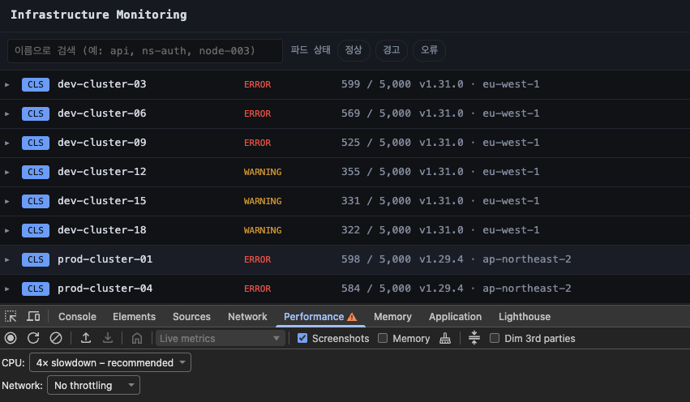
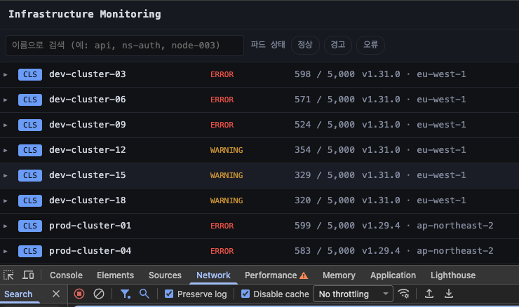
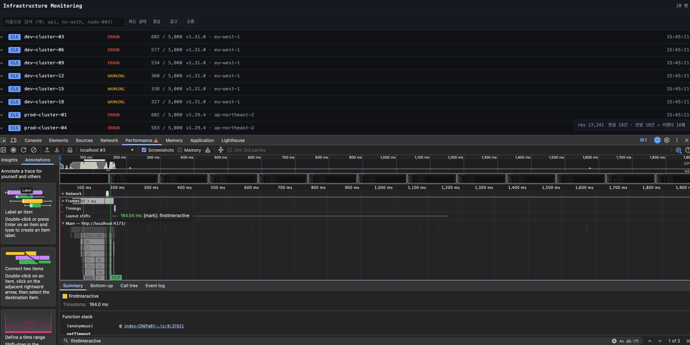
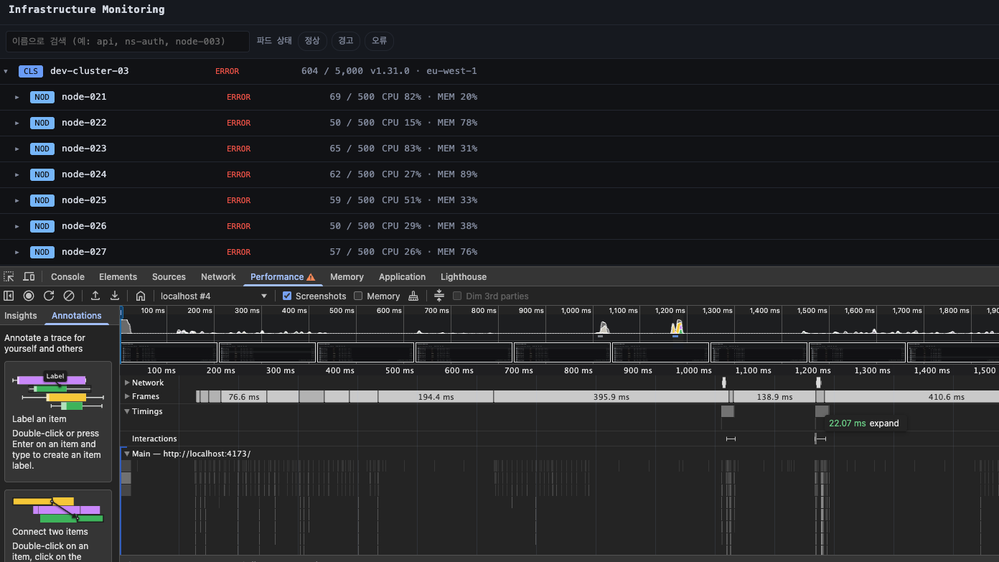
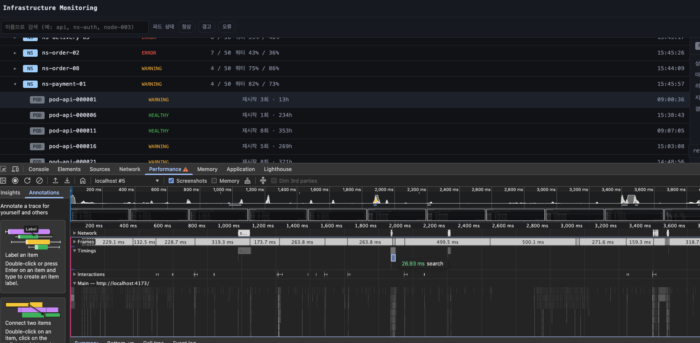
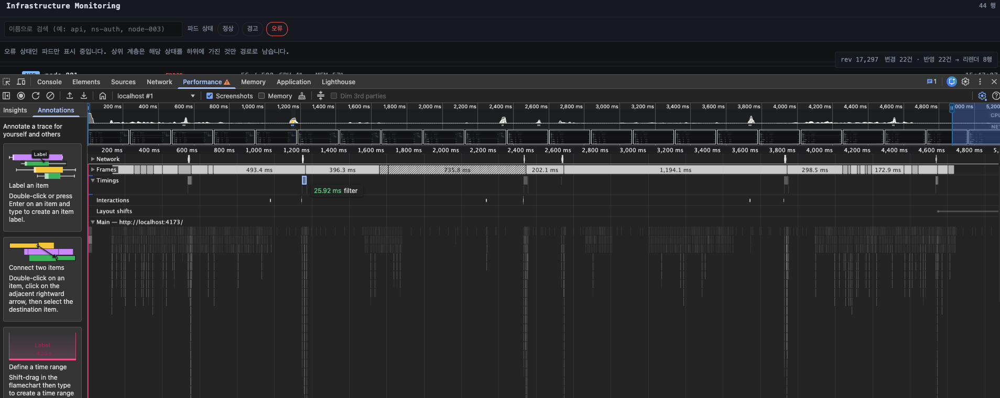
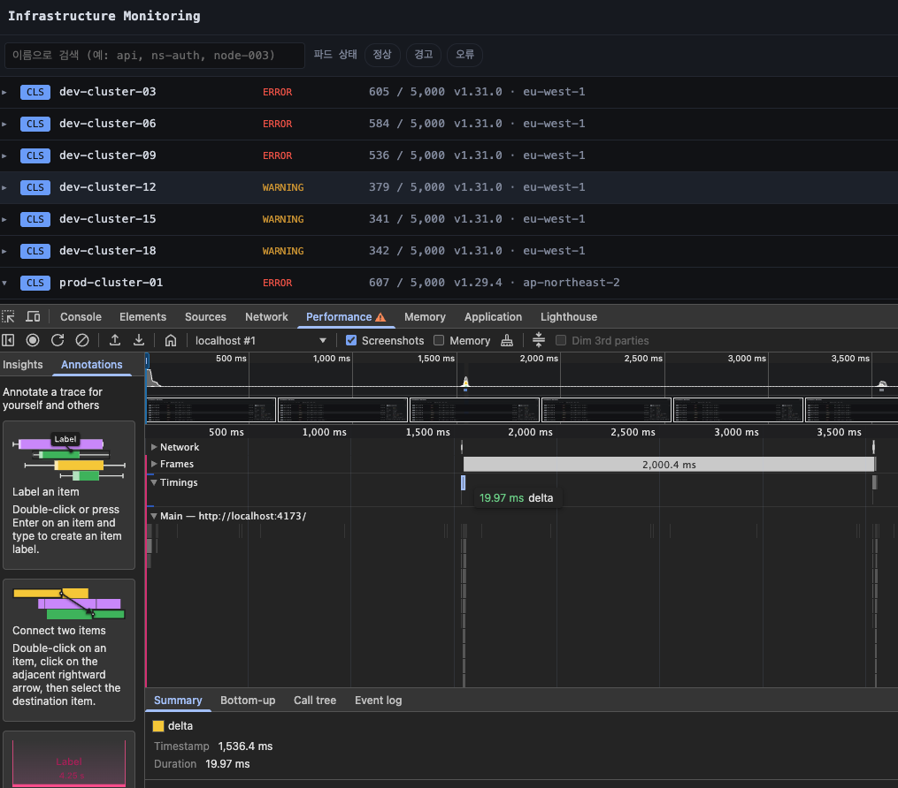

# 성능 측정 상세

README 의 [성능 측정 결과](../README.md#성능-측정-결과) 에서 옮겨 온 근거 문서입니다. 측정 조건과 목표 대비 결과표는 README 에 있고, 여기에는 개발자도구 대조·측정 지점의 정의·메모리 상태별 분해를 둡니다.

## 백엔드 API 응답시간

Testcontainers MySQL 8.4 (버퍼 풀 256M) · 102,220행 · 시드 42 · warm-up 1회 버리고 5회 중위값
재현 = `./gradlew test` → `build/reports/perf/backend-api.md`

| API | 규모 | 목표 | 중위 | 최소 | 최대 |
| --- | --- | ---: | ---: | ---: | ---: |
| `GET /roots` | 클러스터 20건 | 500ms | **3.6ms** | 2.6 | 4.5 |
| `GET /{id}/children` | 파드 50건 | 100ms | **3.7ms** | 3.5 | 3.9 |
| `GET /{id}/children?status=` | 파드 50건 중 오류만 | 200ms | **3.9ms** | 2.8 | 5.7 |
| `GET /{id}/ancestors` | 깊이 4 | 500ms | **3.2ms** | 2.8 | 3.6 |
| `GET /search` | 결과 50건 | 300ms | **7.0ms** | 5.5 | 8.9 |
| `GET /search` (최악) | 결과 0건 = 인덱스를 처음부터 훑는다 | 300ms | **59.0ms** | 58.5 | 59.7 |
| `POST /changes` | 펼친 부모 21개 · 변경 50건 | 200ms | **5.7ms** | 5.4 | 6.3 |
| `POST /changes` (최악) | 전 행이 새 리비전, 화면은 50건 | 200ms | **5.5ms** | 4.1 | 6.3 |

이 수치는 테스트가 만든 `build/reports/perf/backend-api.md` 를 옮긴 것입니다. 측정값이 바뀌면 결과 파일도 함께 바뀌므로, 문서와 어긋나면 드러납니다.

회차마다 흔들립니다. 같은 코드에서 `POST /changes` 가 2.9ms 로도 5.1ms 로도 나옵니다. 전부 한 자릿수 ms 라 커넥션 상태와 JIT 의 영향이 그대로 드러나는 구간이고, 자릿수를 보는 표이지 소수점을 보는 표가 아닙니다. 목표 대비 여유가 가장 적은 `GET /search` (최악) 만 회차에 따라 60ms 안팎을 오갑니다.

적재는 102,220행에 1.7초 걸립니다(JDBC batch 1,000건, `rewriteBatchedStatements=true`).

## 예산 배분

화면 성능 목표는 `API 시간 + 렌더 시간`이라, API 를 먼저 재두면 프론트에 남는 예산이 확정됩니다. 재보니 API 가 화면 목표의 한 자릿수 % 를 씁니다.

| 화면 목표 | API | 프론트 예산 | 실제 화면 시간 |
| --- | --- | --- | --- |
| 최초 진입 500ms | ~4ms | 496ms | **219.3ms** |
| 펼치기 100ms | ~4ms | 96ms | **47.6ms** |
| 검색 300ms | ~7ms (최악 59ms) | 241ms | **24.2ms** |
| 필터 200ms | ~4ms | 196ms | **21.9ms** |
| 갱신 200ms | ~6ms | 194ms | **25.7ms** |

이 표에서 읽을 것은 남은 예산이 아니라 **API 가 차지하는 몫**입니다. 목표의 한 자릿수 % 라 예산이 96ms 든 100ms 든 프론트 설계는 달라지지 않았습니다.

대신 **시간이 어디서 드는지가 확정됐습니다.** 최초 진입 219.3ms 중 서버는 4ms 이므로 나머지는 번들 로드·마운트·렌더입니다. 고칠 곳을 찾을 때 서버부터 볼 이유가 없습니다.

예산이 실제 판단 근거가 된 곳은 검색 하나입니다. 여덟 API 중 유일하게 목표의 20%를 먹는 경로라(최악 59ms), 토큰 경계 매칭을 택할지 말지를 이 숫자로 정했습니다.

### 개발자도구로 대조한 결과

측정 조건은 원문이 지정한 그대로입니다. Performance 탭 `CPU 4x slowdown`, Network 탭 `Disable cache`.

| CPU 4x throttling | 캐시 비활성화 |
| --- | --- |
|  |  |

스크립트가 잰 값이 개발자도구에서도 같게 나오는지 항목마다 확인했습니다. **네 항목(`expand` · `search` · `filter` · `delta`)은 앱이 `performance.measure` 를 직접 남기므로 User Timing 트랙에서 같은 구간을 그대로 읽습니다.**

| 항목 | 스크립트 | 개발자도구 | 읽은 곳 |
| --- | ---: | ---: | --- |
| 최초 진입 | 219.3ms | **164.0ms** | User Timing `firstInteractive` 의 Timestamp |
| 펼치기 | 47.6ms | **22.1ms** | User Timing `expand` 의 Duration |
| 검색 | 24.2ms | **26.9ms** | 〃 `search` |
| 필터 | 21.9ms | **25.9ms** | 〃 `filter` |
| 갱신 | 25.7ms | **20.0ms** | 〃 `delta` |
| 탭 메모리 | 62MB | **66.8MB** | Chrome 작업관리자 "메모리 공간" |

| 최초 진입: `firstInteractive` | 펼치기: `expand` |
| --- | --- |
|  |  |

| 검색: `search` | 필터: `filter` |
| --- | --- |
|  |  |

| 갱신: `delta` | 탭 메모리: 작업관리자 |
| --- | --- |
|  |  |

**두 곳이 벌어지는데 둘 다 스크립트가 불리한 쪽을 잽니다.** 펼치기는 스크립트가 언제나 새 페이지에서 첫 펼치기를 재서 API 왕복이 들어가고(사람이 다시 펼칠 때는 이미 받아 둔 계층이라 조회가 없다), 최초 진입은 스크립트가 회차마다 새 브라우저 컨텍스트를 열어 V8 코드 캐시가 비어 있습니다.

**측정값을 읽을 때의 단서 셋**

**1. 상호작용 항목의 시작·종료 지점**

| 항목 | 시작 | 종료 |
| --- | --- | --- |
| 최초 진입 | `navigationStart` | 클러스터 목록이 그려진 **다음 페인트** |
| 펼치기 | 클릭 직전 | 하위 행이 그려진 다음 페인트 |
| 검색 | **디바운스가 끝나고 요청이 나가는 지점** (원문이 "디바운스 제외") | 결과가 그려진 다음 페인트 |
| 필터 | 클릭 직전 | 목록이 갱신된 다음 페인트 |
| 갱신 | 폴링 요청 직전(네트워크 포함) | 반영된 다음 페인트. **변경이 실제로 있었던 폴링만** 집계한다(0건 응답은 그릴 것이 없어 반영 시간이 정의되지 않는다) |

**페인트 이후에 끝낸다**. `requestAnimationFrame` 안에서 예약한 `setTimeout` 에서 측정을 마칩니다. `useLayoutEffect` 는 페인트 직전이라 실제보다 짧게 나옵니다.

**2. 스크롤은 10만 행을 실제로 만들어 놓고 쟀다**

클러스터 20 → 노드 200 → 네임스페이스 2,000 을 전부 펼쳐 **102,220행**을 만든 뒤(51초) 측정합니다. 그 상태에서도 DOM 에 있는 행은 31개입니다.

전부 펼치는 데 요령이 있습니다. 가상 스크롤이라 **DOM 에 30여 행뿐이어서 나머지를 클릭할 수 없습니다.** ①계층을 한 단계씩(각 단계에서 목록이 아직 220행·2,220행이라 훑을 수 있다) ②**아래에서 위로**(펼치면 새 행이 항상 현재 위치 아래에 생기므로 위로 가면 아직 안 펼친 것들의 자리가 흔들리지 않는다).

fps 절대값 대신 **프레임 간격이 18.2ms(=1000/55)를 넘긴 횟수**로 판정합니다. 디스플레이 주사율에 따라 fps 상한이 60/120/144 로 달라지고, FPS 미터가 보여주는 값도 순간값이라 스크롤 구간 안에서 흔들립니다. 체감을 정하는 것은 평균이 아니라 **끊긴 프레임의 개수**입니다.

**3. 메모리는 상태를 나눠 재고, 회수 후에 잰다**

원문은 **스크롤 항목에만 "10만 건 규모"** 를 못박았고 **메모리 항목에는 규모를 지정하지 않았습니다.** 그러면 우리가 정해야 하는데, 하나만 고르면 유리한 쪽을 고른 것이 됩니다. 그래서 세 상태를 모두 밝히고 대표값만 실사용 규모로 씁니다.

원문 기준은 Chrome 작업관리자인데 그 값은 CDP 로 얻을 수 없습니다. 작업관리자가 보여주는 것은 **탭을 그리는 렌더러 프로세스의 OS 메모리**이므로 그 프로세스를 찾아 직접 읽는다(`SystemInfo.getProcessInfo` → `footprint -p`).

메모리 지표는 Chrome 작업관리자 기준과 맞추기 위해 `phys_footprint` 로 읽습니다.

| 상태 | 렌더러 footprint | JS 상주 | 행 |
| --- | ---: | ---: | ---: |
| 첫 화면 | 44MB | 3.0MB | 20 |
| **실사용 규모 (클러스터·노드)** | **62MB** | 4.0MB | 2,220 |
| 10만 행 전부 펼침 | **176MB** | 37.2MB | 102,220 |
| 전부 접은 뒤 (하위 폐기) | 129MB | **3.7MB** | 20 |

**네 상태 모두 목표(300MB) 안입니다.** 10만 행을 전부 펼친 극단도 176MB 입니다.

개발자도구를 닫고 작업관리자로 직접 확인한 값은 아래와 같습니다. 스크립트가 잰 44~62MB 와 같은 층입니다.


**개선을 실제로 해보고 다시 쟀습니다.** 접으면 그 아래를 버리도록 바꿨더니 이렇게 됐습니다.

```
JS 상주   37.2MB → 3.7MB   (-33.5MB, 열 배)
footprint  176MB →  129MB   (-47MB)
```

**footprint 가 JS 상주 감소분보다 더 줄었다**. 우리가 버린 데이터만큼, 그리고 그 위에 얹혀 있던 렌더 트리까지 함께 회수됐다는 뜻입니다.

다만 **접어도 첫 화면(44MB)으로는 돌아가지 않는다**(129MB). 한 번 커진 힙을 프로세스가 완전히 반환하지는 않기 때문이고, 그건 우리 코드가 통제하는 층이 아닙니다. 접었다 다시 펼 때의 재요청 비용은 펼치기 측정값(47.6ms)에 이미 포함돼 있습니다.
